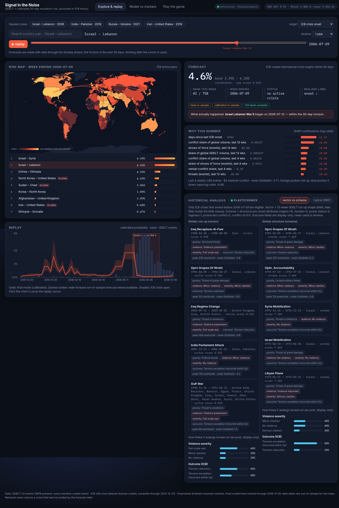

# Signal in the Noise — GDELT → calibrated crisis-escalation forecasts

HackMIT 2026 · Voloridge challenge. Turns the noisy GDELT 1.0 event firehose (1979 → today, ~5,000
files) into **calibrated 30-day escalation probabilities for country pairs**, grounded in the
human-coded **ICB** crisis dataset, explained with SHAP drivers, contextualised with **historical
analogs retrieved from Elasticsearch** (vector + schema + hybrid), and benchmarked against
**prediction markets** — all replayable week by week in a browser.



## One-command demo

```bash
make demo          # pip install -r requirements.txt, npm ci + build, then serve on http://localhost:8000
```

That runs from the git-tracked **demo pack** (`data/artifacts/demo/`, ~140 MB: all 3.03M dyad-week
forecasts for both labels, weekly GDELT features for the 400 most active dyads, ICB cases, resolved
markets) plus `data/artifacts/cases.jsonl` (the 767 ICB case documents also loaded into Elasticsearch).
Without `ES_URL`/`ES_API_KEY` the API falls back to local FAISS/schema retrieval and says so in the UI
header. With them, analogs come from the `signal_icb_cases` index.

```bash
export ES_URL=https://...   ES_API_KEY=...     # optional: server-side only, never sent to the browser
make serve
```

Useful pages (URL hash is the state, so any view is linkable):

* `/#tab=explore&dyad=ISR_LBN&date=2006-07-09` — 2006 Lebanon war run-up (ICB onset 2006-07-12)
* `/#tab=explore&dyad=IND_PAK&date=2019-02-10` — Pulwama/Balakot
* `/#tab=explore&dyad=RUS_UKR&date=2022-02-13` — invasion week (ICB has no coded onset; out-of-sample)
* `/#tab=explore&dyad=CHN_TWN&date=2024-07-28` — live-era replay, no labels
* `/#tab=markets` — Polymarket comparison · `/#tab=game` — You vs Model vs Market

## What you see

| panel | what it is |
|---|---|
| **Risk map** | top-N dyads for the selected week, arcs coloured by raw score, click to select |
| **Replay slider** | scrub any Sunday 1979-01-07 → 2026-09-20; series chart shows calibrated p, 80 % band, raw percentile, GDELT event bars, ICB onsets |
| **Forecast card** | `p_cal` (isotonic, fit on later validation years only), Wilson 80 % band per isotonic step, raw-score rank among all active dyads that week, flags for *trees out-of-sample*, *calibration out-of-sample*, *ICB label unavailable (post-2021)* |
| **Drivers** | SHAP contributions for this dyad-week (falls back to global importance for dyads outside the demo pack) |
| **Analogs** | vector kNN (13-week GDELT run-up) **and** schema search (pre-onset ICB attributes) side by side, hybrid RRF fusion, outcome distribution of the analogs (ex-post ICB fields, display-only) — every analog ended before the query date |
| **Markets** | 60 resolved Polymarket escalation questions, market price 30 d before resolution vs the model, Brier scores, leave-one-out stack |
| **Game** | 8 seeded episodes (ICB onsets + resolved markets); you guess, then see model + market; Brier per side, streak |

More screenshots: `docs/screenshots/` (`explorer_ind_pak_2019.png`, `explorer_chn_twn_2024.png`,
`markets.png`, `game.png`).

## Architecture

```
GDELT 1.0 zips ──► pipeline/gdelt_ingest.py ──► dyad-day parquet (dedup, stale-row filter, CAMEO/Quad/Goldstein/tone)
                                                 │
ICB v16 csv ─────► pipeline/icb_prepare.py ────┐ ▼
   (system/actor/dyad, actor-code → ISO3,      │ pipeline/features.py  → dyad-week panel (dense calendar grid,
    variable tiers pre/at/ex-post)             │                          1/4/13/52-week windows, rates, ICB history)
                                               ▼ labels/build_labels.py → y_icb (onset ≤30d), y_thresh (Q4 surge), in_crisis
                                                 │
                    models/train.py (walk-forward LightGBM, 30-d gap, isotonic on validation, baselines, SHAP)
                    models/score.py  → forecasts.parquet (p_raw, p_cal, band, rank) for every dyad-week
                                                 │
   retrieval/vectors.py (78-d run-up vector) ────┼──► retrieval/build_cases.py → cases.jsonl
   retrieval/index_es.py ────────────────────────┼──► Elasticsearch  signal_icb_cases  (dense_vector + ICB fields)
                                                 │         ▲ kNN with date filter inside knn.filter, schema bool query, RRF
   markets/collect.py + compare.py ──────────────┤         │
                                                 ▼         │  server-side only
                    app/api (FastAPI + DuckDB) ────────────┘
                                                 │  /api/map /dyad/…/forecast /series /analogs /markets /game
                                                 ▼
                    app/frontend (React + Vite, d3-geo, Recharts)
```

**Where Elasticsearch fits:** it is the *serving* store for historical-analog retrieval — one
document per ICB crisis-dyad with the 78-d GDELT run-up vector (`dense_vector`, cosine) plus the
pre-onset/at-onset ICB attributes as keyword/numeric fields, so one request can do kNN with a
`end_date < query_date` filter *inside* the kNN clause, a boolean schema query, or both (hybrid,
RRF client-side). **Where it does not fit:** the 3M-row analytical panel, training, scoring and
market joins live in parquet + DuckDB; ES holds only what is queried interactively and can be
rebuilt from parquet (`make index-es`). The browser never talks to ES.

## Results (walk-forward, pooled over 6 test folds 1997-2021, n = 1.36M dyad-weeks)

Primary label `y_icb` — ICB crisis onset for the dyad within 30 days (411 positives, base rate 0.03 %):

| model | Brier | log-loss | AUC | AP |
|---|---|---|---|---|
| LightGBM raw | 0.000301 | 0.00226 | **0.904** | 0.0074 |
| LightGBM + isotonic | 0.000300 | 0.00236 | 0.879 | 0.0057 |
| persistence (last week's ICB state) | 0.000300 | 0.00250 | 0.868 | 0.0066 |
| logistic (same features) | 0.000689 | 0.00446 | 0.780 | 0.0132 |
| base rate | 0.000301 | 0.00294 | 0.637 | 0.0007 |

Secondary label `y_thresh` — QuadClass-4 events in the next 30 days ≥ 3× trailing-year rate and ≥ 20 (2.5 % base rate):

| model | Brier | log-loss | AUC | AP |
|---|---|---|---|---|
| LightGBM raw | 0.02397 | 0.1060 | 0.770 | 0.131 |
| LightGBM + isotonic | **0.02396** | 0.1059 | 0.774 | 0.131 |
| persistence | 0.02496 | 0.1179 | 0.562 | 0.049 |
| logistic | 0.02666 | 0.1251 | 0.675 | 0.065 |
| base rate | 0.02537 | 0.1218 | 0.498 | 0.026 |

Read honestly: on the ICB label the ranking signal is strong (AUC 0.90) but the event is so rare
that Brier barely moves off the base rate and the isotonic map has few steps (max calibrated
p ≈ 4-6 %). Per-fold numbers, calibration curves, PR curves/operating points, feature importance
and SHAP are in `data/artifacts/models/<label>/` (`metrics.json`, `calibration.json`,
`pr_curve.json`, `shap_summary.csv`) and surfaced in the app.

**Retrieval head-to-head** (`docs/retrieval_eval.md`, 96 held-out post-1995 crises, k = 5): ES hybrid
gets 0.49 violence-severity agreement vs 0.17 for the majority-prior baseline; schema search
dominates region hit-rate, vector search is the cheapest; every returned analog satisfies
`end_date < query_date` (asserted at run time).

**Prediction markets** (`markets/compare.py`, 60 resolved Polymarket escalation/ceasefire questions
over 20 dyads, 2023-11 → 2025, price snapshot 30 days before resolution; ceasefire questions *and*
negated questions such as "Will **no** US × Venezuela military engagement occur?" are re-oriented so
YES = escalation): market Brier 0.250, base-rate 0.248, model-as-answer-to-the-market-question 0.443
(the model forecasts *ICB onsets*, not "strike by Friday" questions — this diagnostic is shown, not
spun). The fair test is the leave-one-out logistic stack: market-only 0.2222 vs market + model 0.2221 — the GDELT signal adds
essentially nothing on top of markets for these questions, and we say so in the UI. Nothing here
supports a claim that either side "beats" the other.

## Data caveats (short; full list in `docs/ASSUMPTIONS.md`)

* **GDELT regime break** (yearly → monthly → daily files in 2013-04; daily files contain old events):
  stale rows (>7 days before the file date) are dropped, `regime_daily` is a feature, and SHAP shows
  the model using it. Two daily files 404 on GDELT's server (2022-11-10, 2023-03-23) and GDELT
  published nothing for 2025-06-15 → 2025-07-01; missing weeks are zero-filled in a dense calendar
  grid so windows always cover exactly 7k days.
* **ICB ends in 2021** (v16, last onset 2021-09-20; the "Russian invasion of Ukraine" row is an
  undated placeholder and is excluded). Everything after 2021-12-31 has features but no label —
  the app flags it and the final model's trees/calibration are strictly out-of-sample there.
* **Dedup is heuristic** (same SQLDATE/actors/event/geo → one event, max mentions); GDELT has no
  duplicate key.
* **Dyad universe** = pairs with ≥ 200 deduplicated events in the trailing 365 days or ever an ICB
  dyad (4,879 dyads, 3.03M rows) — trailing information only. Unknown/inactive dyads return
  `available: false` and the UI says so.
* **Leakage controls:** features are functions of rows with arrival day ≤ t (test recomputes windows
  from raw weekly sums); labels use (t, t+30d]; 30-day gap before every validation/test window;
  calibration fit only on the validation slice; ex-post ICB variables are typed as display-only and
  tested never to appear in feature lists or retrieval queries (`tests/test_leakage.py`,
  `tests/test_api.py`).

## Demo script (3 minutes)

1. **Map, 2006-07-09.** Israel–Lebanon is #1 of ~760 active dyads three days before the ICB-coded
   onset; open it, point at the band and rank, then the SHAP drivers (rate_w13, Q4 share, tone).
2. **Analogs.** Vector column pulls 1990s-2000s Levant flare-ups; schema column pulls
   territorial/protracted-conflict crises; hybrid mixes both — note "ended before 2006-07-09" on each
   and the outcome histogram.
3. **Scrub to 2019-02-10, IND_PAK**, then **2022-02-13, RUS_UKR** — the label flag turns to "no ICB
   label" and the card says the trees are out-of-sample.
4. **Markets tab.** Show a ceasefire market (inverted to escalation), the raw-vs-market Brier and
   the stack line: "markets already know this; GDELT adds ~0 here".
5. **Game.** Play 3 episodes; show the You/Model/Market Brier scoreboard and streak.

## Reproduce the whole pipeline

```bash
make icb                                   # ICB v16 download, actor→ISO3 mapping, coverage report, variable tiers
make ingest GDELT_OUT=data/processed/gdelt # ~5,000 GDELT 1.0 zips (~40 GB), dedup, dyad-day parquet   (hours)
make features labels                       # dyad-week panel + labels (minutes with 8+ cores)
make train score                           # walk-forward LightGBM, calibration, baselines, SHAP; score all weeks
make cases index-es retrieval-eval         # run-up vectors, ICB case docs, ES index, head-to-head
make markets pack                          # Polymarket/Kalshi collection + comparison, then rebuild the demo pack
make test lint                             # pytest (ingest, leakage, API) + pyflakes + tsc
```

`config.yaml` is the single source of truth for dates, thresholds, fold boundaries, market
selection and retriever weights; every key in it is read by some stage. Intentionally fixed in
code instead: the 1/4/13/52-week rolling windows and regime flag (`pipeline/features.py`), the
market keyword regexes (`markets/compare.py`) and the 13x6 run-up vector layout
(`retrieval/vectors.py`, checked against `retrieval.vector_dim`). Each trained model writes
`train_meta.json` (final train/calibration boundary) which the API uses for its in/out-of-sample
flags. Every stage writes parquet under `data/processed/` and reports under `docs/`
(`icb_coverage.md`, `labels_report.md`, `retrieval_eval.md`, `icb_variable_tiers.md`,
`STATUS.md`, `ASSUMPTIONS.md`).

## Out of scope / future

* GDELT 2.0 (15-minute) and GKG themes; multilingual sources beyond what GDELT 1.0 already codes.
* Directed dyads (who escalates against whom) — the panel is undirected with an asymmetry feature.
* Learned vector encoders / PCA (rejected for now because fitting on all cases would leak future
  crises into the basis); learned schema weights.
* Live daily re-scoring and the `signal_dyad_forecasts` serving index (scores are precomputed weekly).
* Kalshi: collected but no settled escalation markets matched; Metaculus not attempted.
* Conformal / bootstrap bands over the raw score (the band shown is the isotonic-step Wilson interval).
